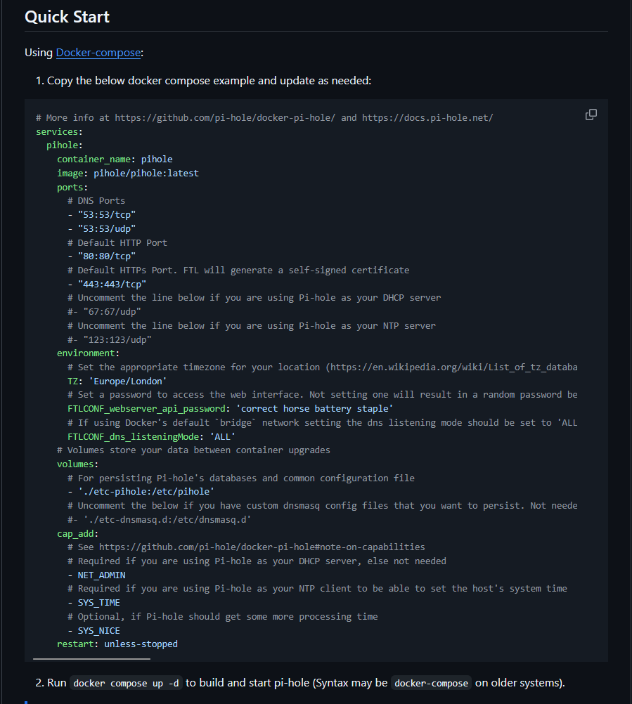
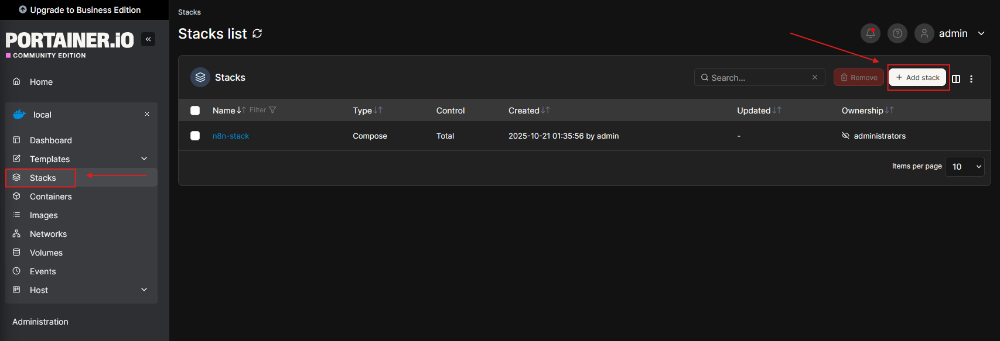
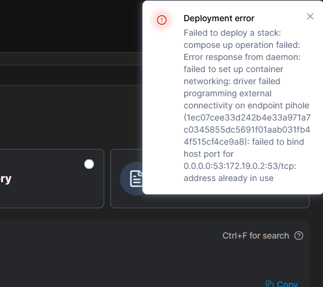
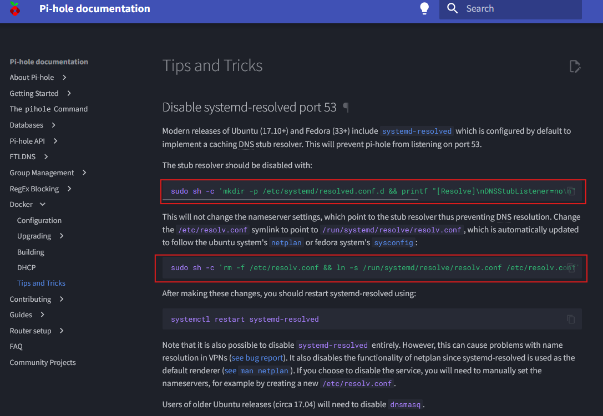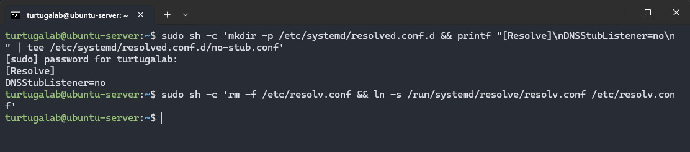
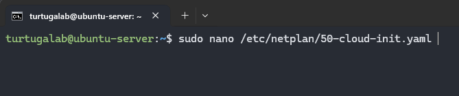
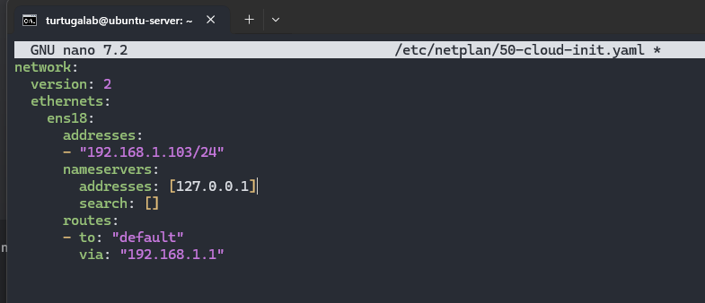
Delete the 8.8.8.8 address and replace with 127.0.0.1.
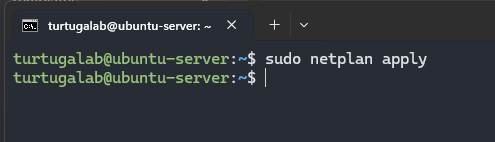

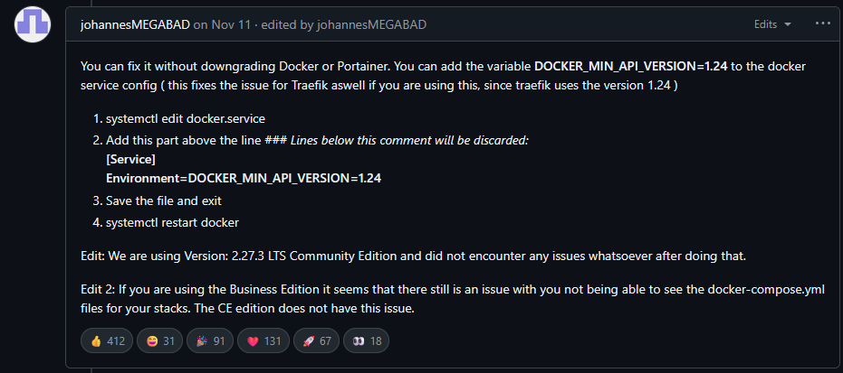
This is an optional fix for my documentation purposes. Seems like the newest version of Docker/Portainer had some issues and caused my local environment to be down. This helped fixed the issue.

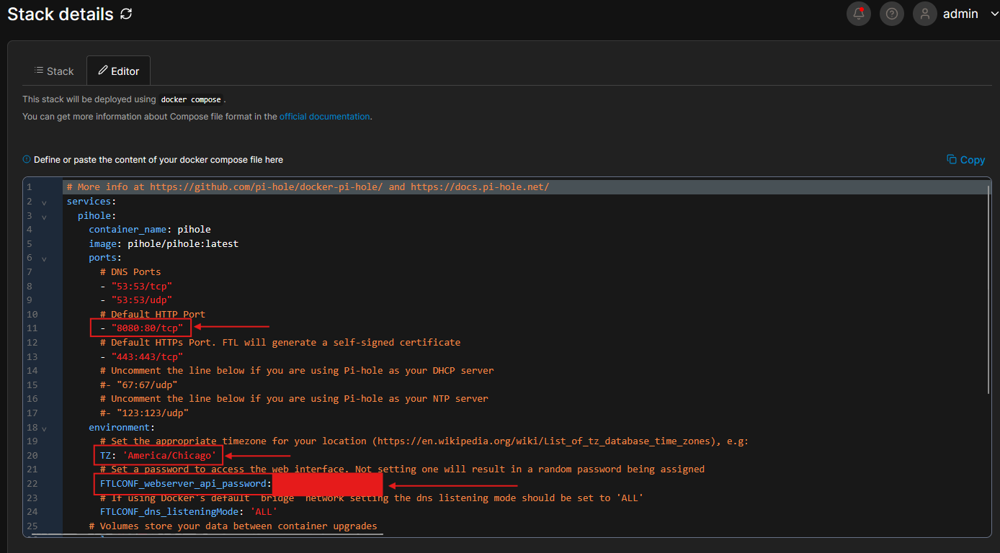

FOR ERROR: ;; communications error to 127.0.0.1#53: connection refused ;; no servers could be reached
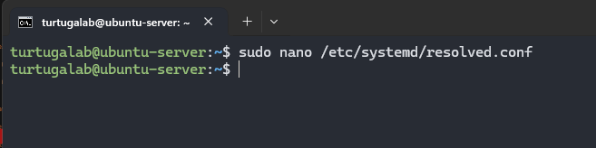

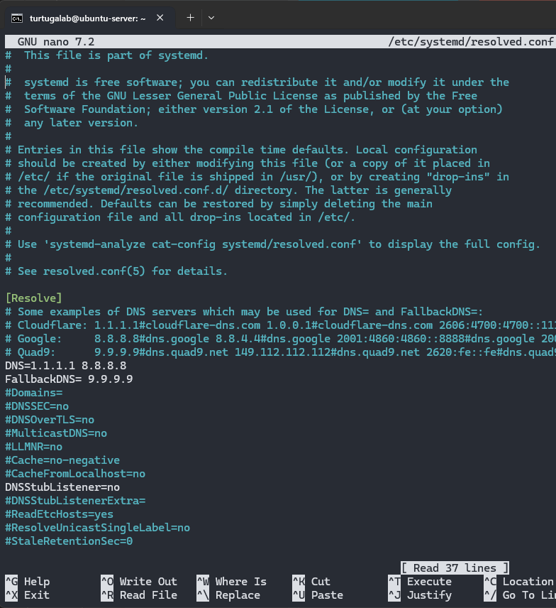

sudo systemctl restart systemd-resolved

sudo rm -f /etc/resolv.conf
sudo ln -s /run/systemd/resolve/resolv.conf /etc/resolv.conf
cat /etc/resolv.conf
sudo systemctl restart docker
sudo docker restart pihole

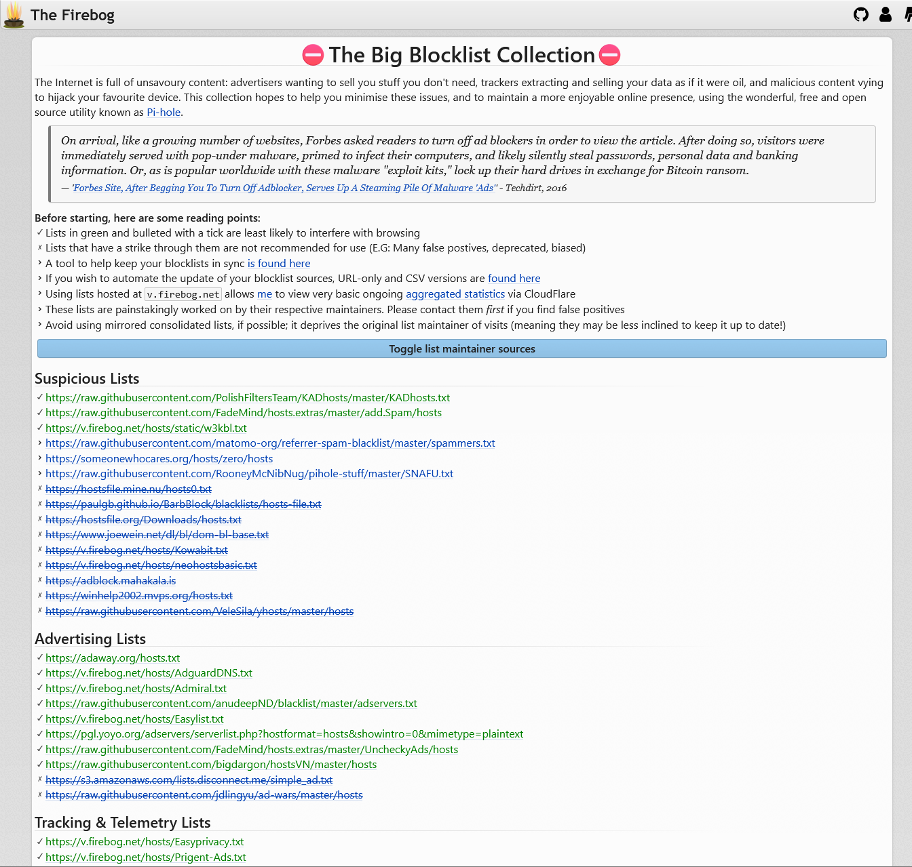

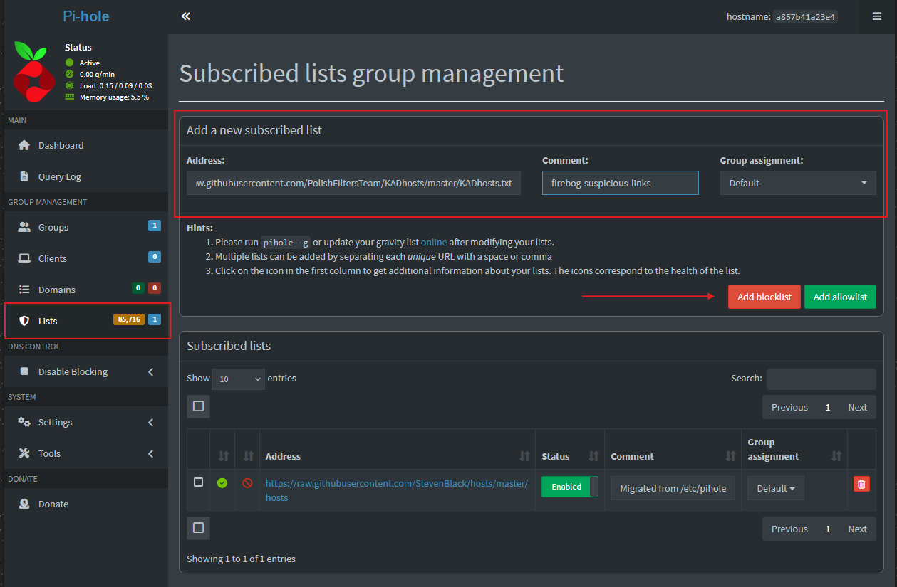

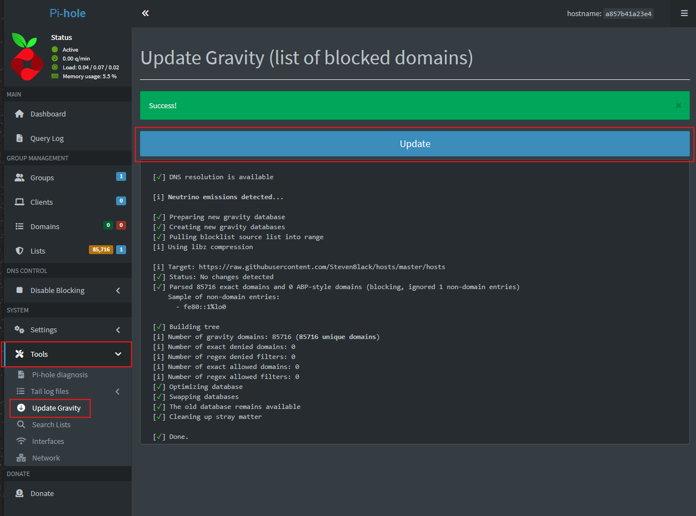
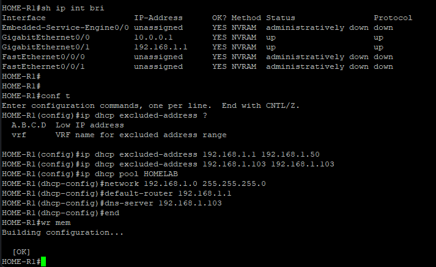

