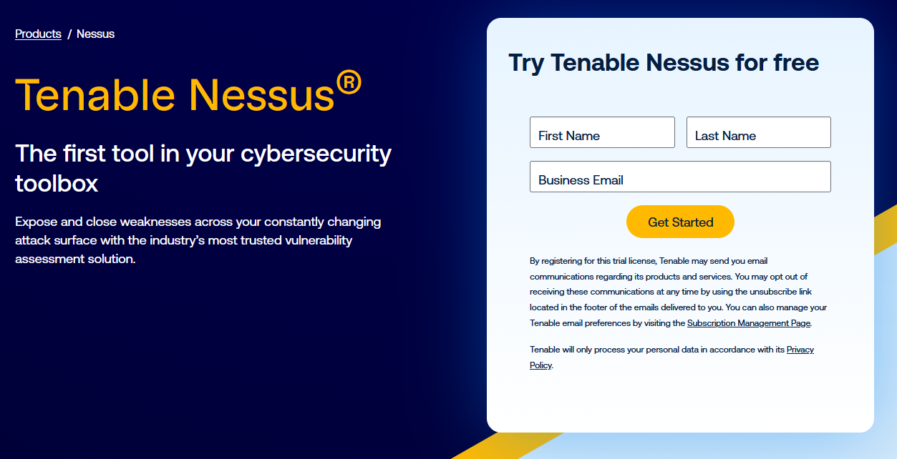
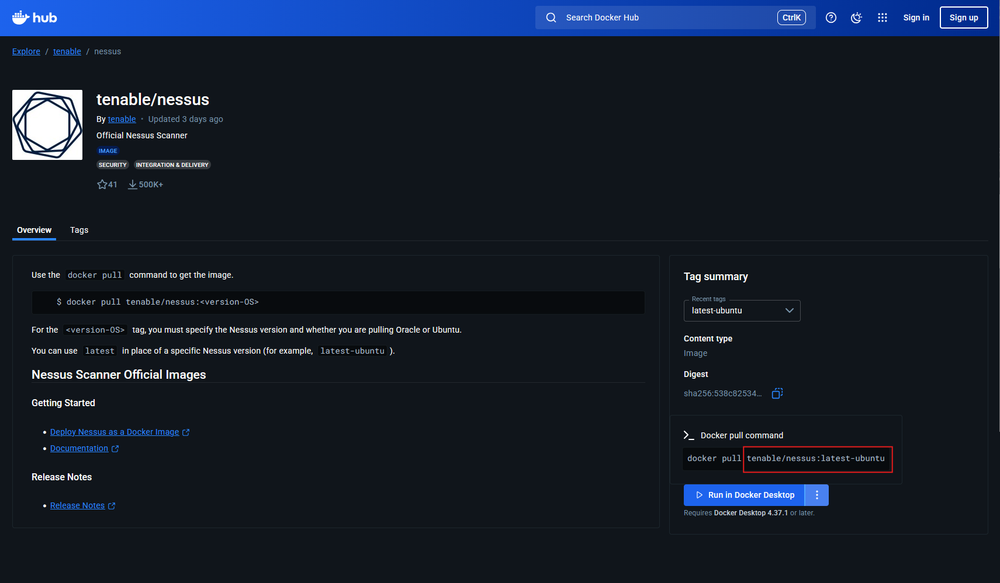
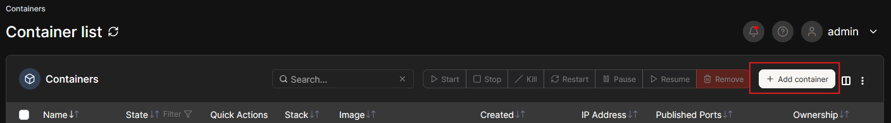
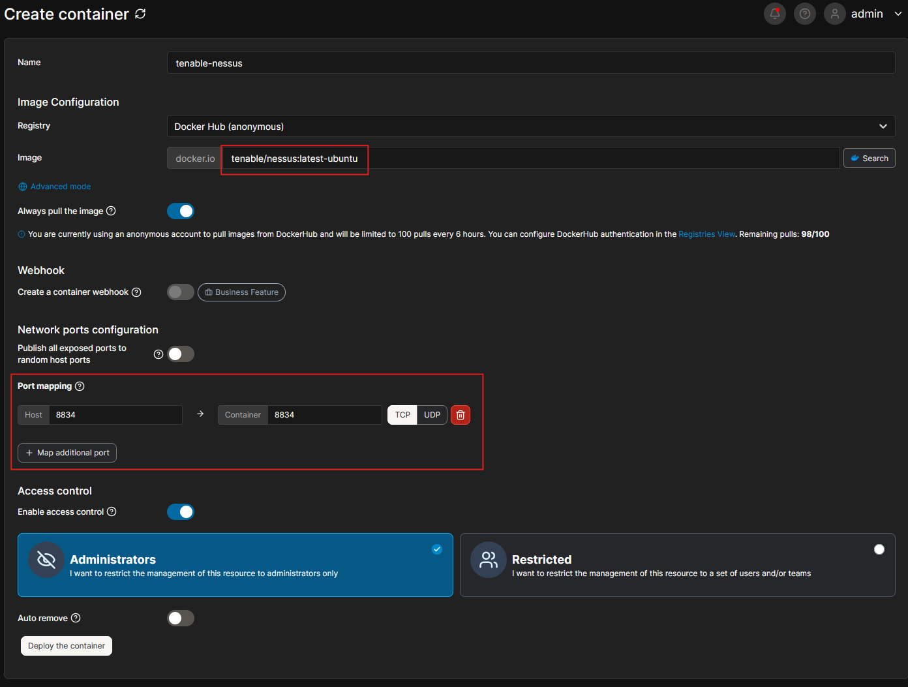
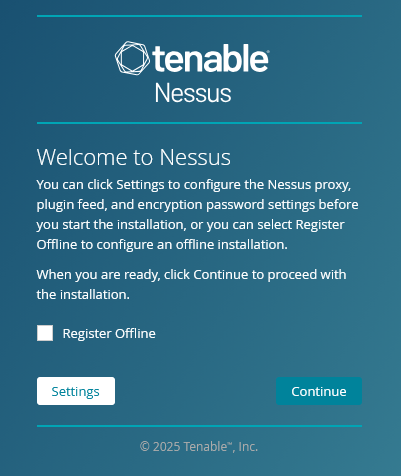
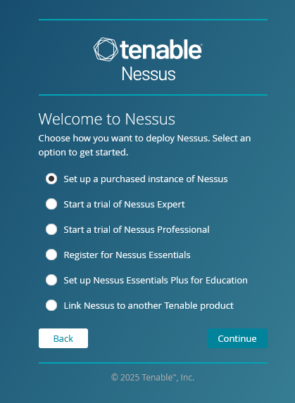
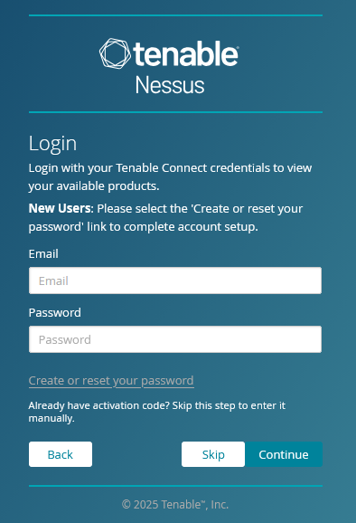
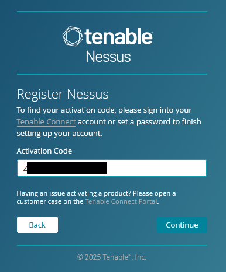
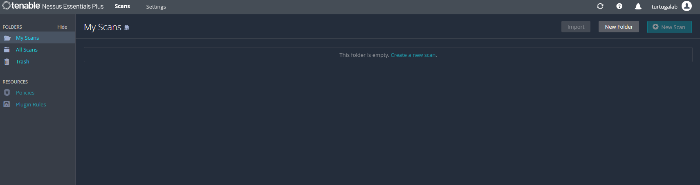

Sign up for the free Tenable Nessus Essentials license.

Navigate to https://hub.docker.com/r/tenable/nessus

Take note of the command.

Deploy the container.

Once deployed, navigate to https://[remote-ip]:8834

I will skip this step.

Then create a Tenable Nessus administrator account and continue.

The setup is now complete.